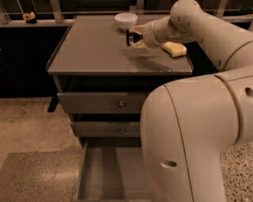
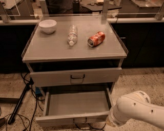
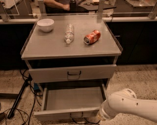
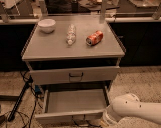
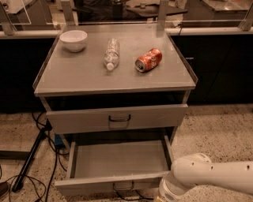

# README from dshong

## How to run?

1. Clone the repository
    ```bash
    git clone https://github.com/dazory/robotic_transformer_pytorch.git
    ```
2. Run docker
   ```bash
   docker pull dshong/rt:rt-1-pytorch-tf
   cd $REPO_PATH
   ./run_docker 0
   ```
3. Train the model
   ```bash
   cd $REPO_PATH
   python3 main.py \
   --train-split "train[:1000]" \
   --eval-split "train[:1000]" \
   --train-batch-size 8 \
   --eval-batch-size 8 \
   --eval-freq 100 \
   --checkpoint-freq 1000
    ```
4. Inference with the pretrained model
    
    You can download the checkpoint files at [here](https://drive.google.com/file/d/1XzlTR9j3c4moiolCbuDFHjmpyMdU6MMQ/view?usp=drive_link). After downloading `rt1` and replace it with the `rt1` folder in `robotic_transformer_pytorch/checkpoints` folder.
   ```bash
   cd $REPO_PATH
   python3 eval.py \
   --eval-split "train[:1000]" \
   --eval-batch-size 2 \
   --eval-freq 100 \
   --checkpoint-freq 1000 \
   --load-checkpoint "checkpoints/rt1/checkpoint_32000_loss_133.915.pt" 
   ```
   
## Results

### Training and evaluation loss

You can see the training loss at [wandb](https://wandb.ai/hong-dasol/rt1-pytorch?workspace=user-hong-dasol).

## Examples of dataset

```python
from data import create_dataset

eval_dataset = create_dataset(
    datasets="fractal20220817_data",
    split="train[:1000]",
    trajectory_length=6,
    batch_size=2,
    num_epochs=1)
with torch.no_grad():
    for batch in eval_dataset:
       # ...
```
,where
```text
batch: {dict: 2}
  L observation: {dict: 3}
  |  L image: {ndarray: (8, 6, 256, 320, 3)}
  |  L embedding: {ndarray: (8, 6, 512)}
  |  L instruction: {ndarray: (8, 6)}
  L action: {dict: 3}
     L world_vector: {ndarray: (8, 6, 3)}
     L base_displacement_vertical_rotation: {ndarray: (8, 6, 1)}
     L terminate_episode: {ndarray: (8, 6)}
     L rotation_delta: {ndarray: (8, 6, 3)}
     L base_displacement: {ndarray: (8, 6, 2)}
     L gripper_closedness_action: {ndarray: (8, 6, 1)}
```

### `image` and `instruction`

<details>
<sumary>example1</sumary>

`image`:





`instruction`:
```text
"pick rxbar chocolate from bottom drawer and place on counter"
```
</details>


<details>
<sumary>example2</sumary>

`image`:








`instruction`:
```text
"close middle drawer"
```
</details>


# Original version of README
---

</img>

## Robotic Transformer - Pytorch

Implementation of <a href="https://ai.googleblog.com/2022/12/rt-1-robotics-transformer-for-real.html">RT1 (Robotic Transformer)</a>, from the Robotics at Google team, in Pytorch

## Install

```bash
$ pip install robotic-transformer-pytorch
```

## Usage

```python
import torch
from robotic_transformer_pytorch import MaxViT, RT1

vit = MaxViT(
    num_classes = 1000,
    dim_conv_stem = 64,
    dim = 96,
    dim_head = 32,
    depth = (2, 2, 5, 2),
    window_size = 7,
    mbconv_expansion_rate = 4,
    mbconv_shrinkage_rate = 0.25,
    dropout = 0.1
)

model = RT1(
    vit = vit,
    num_actions = 11,
    depth = 6,
    heads = 8,
    dim_head = 64,
    cond_drop_prob = 0.2
)

video = torch.randn(2, 3, 6, 224, 224)

instructions = [
    'bring me that apple sitting on the table',
    'please pass the butter'
]

train_logits = model(video, instructions) # (2, 6, 11, 256) # (batch, frames, actions, bins)

# after much training

model.eval()
eval_logits = model(video, instructions, cond_scale = 3.) # classifier free guidance with conditional scale of 3

```

## Appreciation

- <a href="https://stability.ai/">Stability.ai</a> for the generous sponsorship to work and open source cutting edge artificial intelligence research


## Todo

- [x] add classifier free guidance option
- [x] add cross attention based conditioning

## Citations

```bibtex
@inproceedings{rt12022arxiv,
    title    = {RT-1: Robotics Transformer for Real-World Control at Scale},
    author   = {Anthony Brohan and Noah Brown and Justice Carbajal and  Yevgen Chebotar and Joseph Dabis and Chelsea Finn and Keerthana Gopalakrishnan and Karol Hausman and Alex Herzog and Jasmine Hsu and Julian Ibarz and Brian Ichter and Alex Irpan and Tomas Jackson and  Sally Jesmonth and Nikhil Joshi and Ryan Julian and Dmitry Kalashnikov and Yuheng Kuang and Isabel Leal and Kuang-Huei Lee and  Sergey Levine and Yao Lu and Utsav Malla and Deeksha Manjunath and  Igor Mordatch and Ofir Nachum and Carolina Parada and Jodilyn Peralta and Emily Perez and Karl Pertsch and Jornell Quiambao and  Kanishka Rao and Michael Ryoo and Grecia Salazar and Pannag Sanketi and Kevin Sayed and Jaspiar Singh and Sumedh Sontakke and Austin Stone and Clayton Tan and Huong Tran and Vincent Vanhoucke and Steve Vega and Quan Vuong and Fei Xia and Ted Xiao and Peng Xu and Sichun Xu and Tianhe Yu and Brianna Zitkovich},
    booktitle = {arXiv preprint arXiv:2204.01691},
    year      = {2022}
}
```

```bibtex
@inproceedings{Tu2022MaxViTMV,
    title   = {MaxViT: Multi-Axis Vision Transformer},
    author  = {Zhengzhong Tu and Hossein Talebi and Han Zhang and Feng Yang and Peyman Milanfar and Alan Conrad Bovik and Yinxiao Li},
    year    = {2022}
}
```

```bibtex
@misc{peebles2022scalable,
    title   = {Scalable Diffusion Models with Transformers},
    author  = {William Peebles and Saining Xie},
    year    = {2022},
    eprint  = {2212.09748},
    archivePrefix = {arXiv},
    primaryClass = {cs.CV}
}
```
